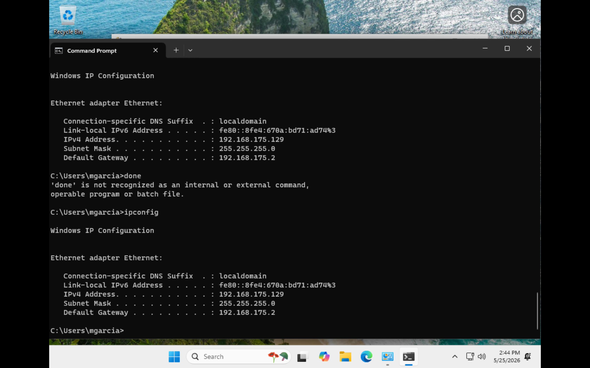
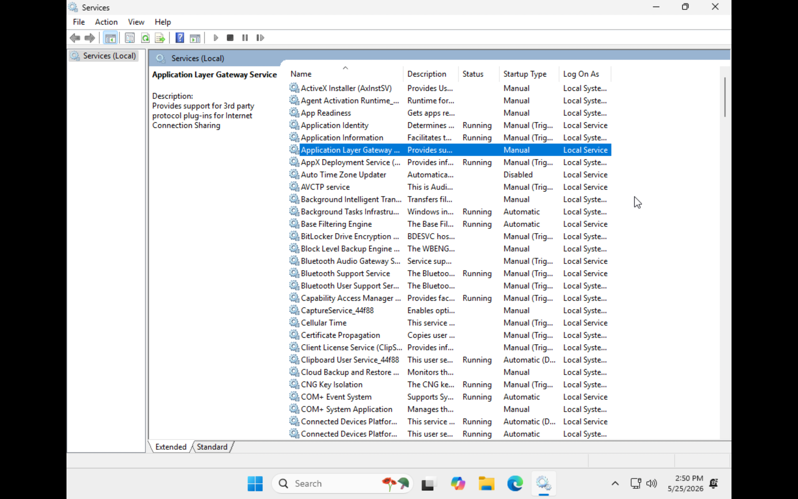

# Windows 11 Help Desk Home Lab

## Overview

Built a Windows 11 ARM virtual machine using VMware Fusion on an Apple Silicon MacBook.

This home lab was created to simulate real-world IT support and help desk tasks including:

- Local user management
- Network adapter troubleshooting
- IP configuration analysis
- Services management
- Task Manager monitoring
- User account administration
- Basic Windows system administration

---

## Technologies Used

- VMware Fusion
- Windows 11 ARM
- macOS
- Command Prompt
- Task Manager
- Services.msc
- Network Adapter Settings
- User Account Management

---

## Lab Tasks Completed

### 1. Created Windows 11 ARM VM
- Installed Windows 11 ARM on VMware Fusion
- Configured local administrator account

### 2. User Management
- Created local users
- Modified user permissions
- Viewed administrator/user groups

### 3. Network Troubleshooting
- Viewed adapter properties
- Verified driver installation
- Collected IP configuration using ipconfig
- Reviewed IPv4 addressing and gateway information

### 4. System Monitoring
- Opened Task Manager
- Reviewed CPU and memory usage
- Identified background processes

### 5. Windows Services
- Opened services.msc
- Reviewed startup types and running services

---

## Skills Demonstrated

- Windows Administration
- Help Desk Troubleshooting
- Networking Fundamentals
- TCP/IP Basics
- User Account Management
- System Diagnostics
- VMware Virtualization
- IT Support Workflow

---

## Screenshots

### Ethernet Adapter Configuration
Reviewed Ethernet adapter configuration settings and verified connectivity options.

---

### Ethernet Adapter Properties
Inspected adapter properties, protocols, and network client configurations.

---

### IP Configuration Analysis
Used `ipconfig` to analyze IPv4 addressing, subnet mask, and default gateway information.

---

### Windows Services Console
Reviewed Windows services, startup types, and running background services using `services.msc`.

---

### Task Manager Monitoring
Monitored system resource usage, running processes, and background applications through Task Manager.

---

### User Account Configuration
Configured and reviewed local user account settings and permissions.

---

### User Account Management
Managed local users and groups through Windows administrative tools.

